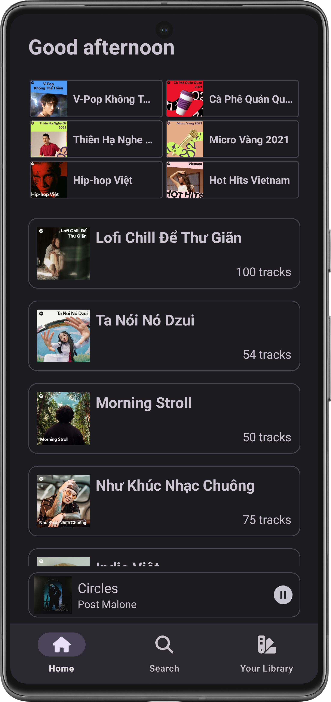
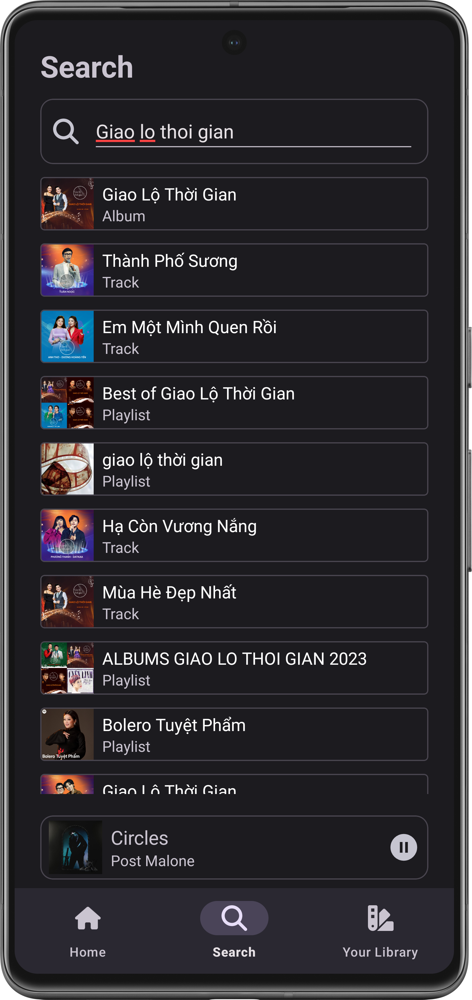
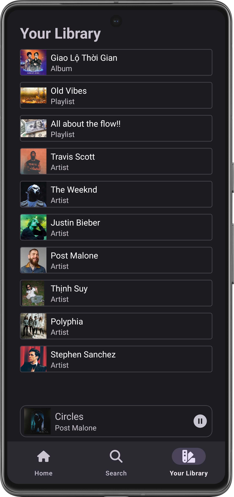
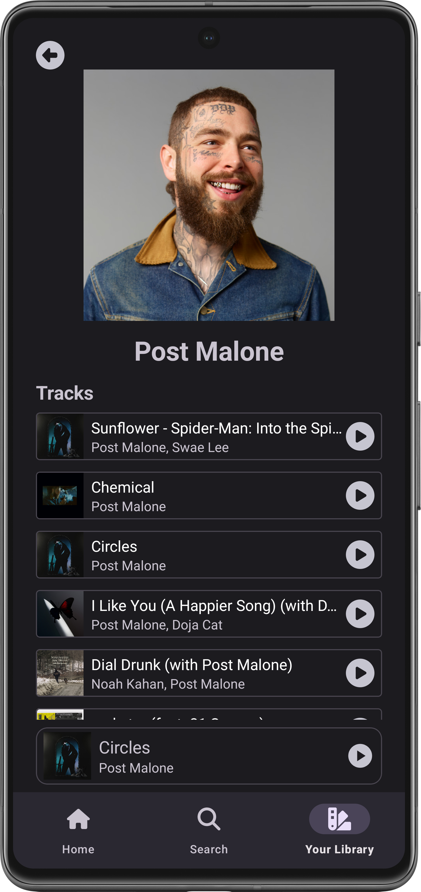
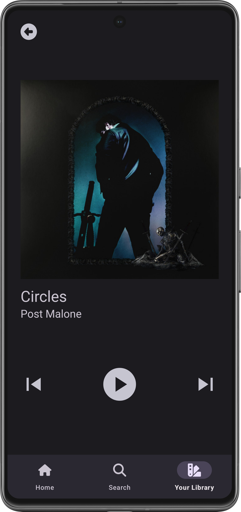

## Information
Soundify is a clone of the famous music streaming app Spotify. This app provides the basic functions of a music streaming app, including recommending tracks, searching, viewing collection and artist information, and playing tracks.
## Techniques and implementations
-	The app is developed using the **Kotlin** programming language, and **View-based XML** as its UI framework.
-	The app architecture follows the structure of hosting multiple fragments in a single activity.
-	App authorization and user authentication are done by using the official **Spotify Web APIs**.
-	The app handles the data requests to and responses from the Spotify server asynchronously using **Kotlin coroutines, flows and StateFlows**.
-	This app uses **Navigation component and deep links** to handle the navigations between fragments and between the hosting activity and its fragments.
-	This app uses **Media3 ExoPlayer** to stream music and **Glide** to fetch artworks from URLs.
## Screenshots

  
   
  
  
  
  

