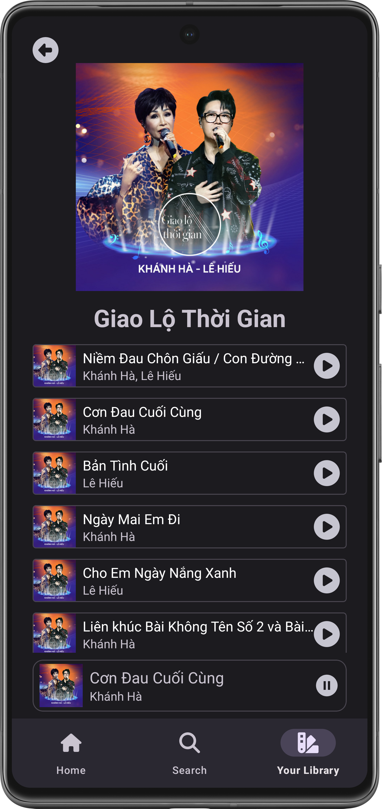

## Information
This app is a music streaming app using the Spotify Web APIs. Its functions include recommending tracks, searching, viewing collection and artist information, and playing tracks.
## Techniques and implementations
-	The app is developed using the **Kotlin** programming language, and **View-based XML** as its UI framework.
-	The app architecture follows the structure of hosting multiple fragments in a single activity.
-	App authorization and user authentication are done by using the official **Spotify Web APIs**.
-	The app handles the data requests to and responses from the Spotify server asynchronously using **Kotlin coroutines, flows and StateFlows**.
-	This app uses **Navigation component and deep links** to handle the navigations between fragments and between the hosting activity and its fragments.
-	This app uses **Media3 ExoPlayer** to stream music and **Glide** to fetch artworks from URLs.
-	This app uses [**spotify-web-api-kotlin**](https://github.com/adamint/spotify-web-api-kotlin) by adamint to handle requesting and fetching data from Spotify APIs.
## Screenshots

  
   
  
  
  
  

## Setting up
As per the Spotify policies of using the Web API, personal projects must add users to a list of registered users for them to successfully authenticate into the app. Therefore, the limitation is that to test the app, we must add the users to the Spotify dashboard by hand. If you want to test the app, please contact us.

